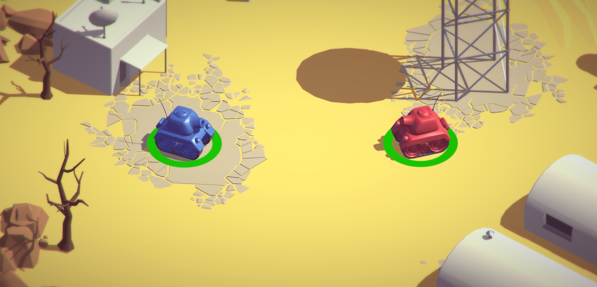
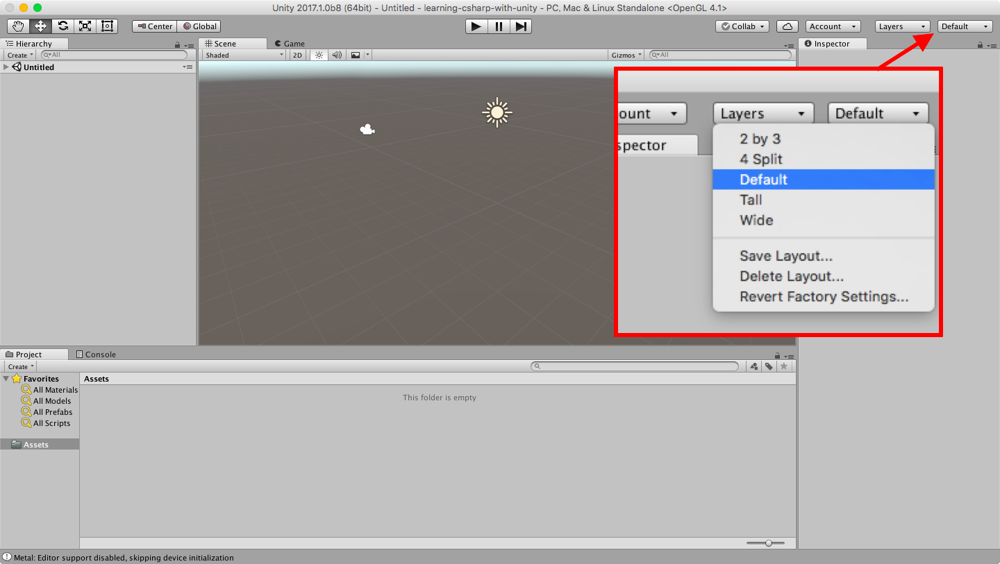
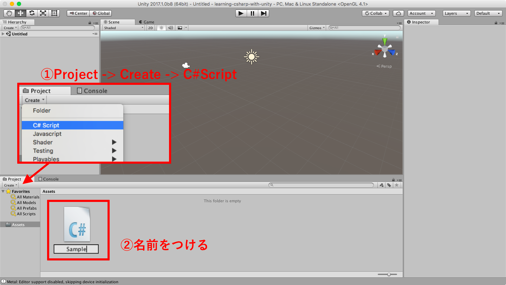
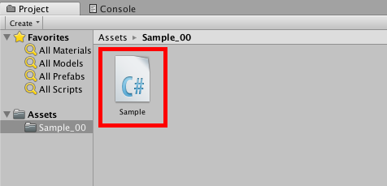
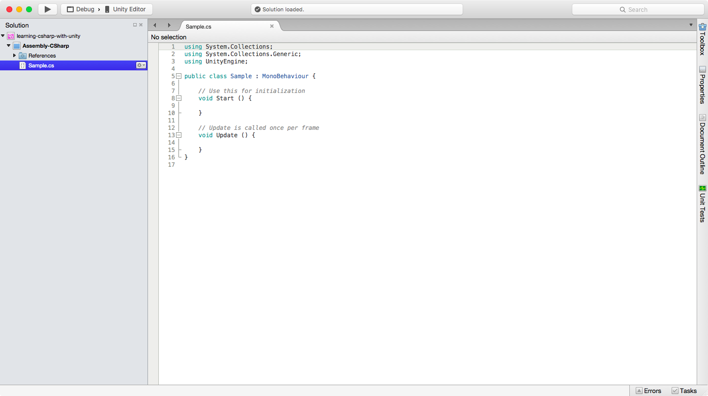
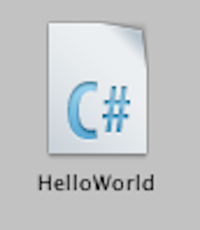

# Unityで覚える<span>C#</span>

---

# こんにちは

---


ないち

@naichilab

---

## 何してる人？

* 職業：プログラマー
* 趣味：Unity/C#
* それっぽい資格
  * NW/DB/SCとか

---

# 今日話すこと

---

## <span>C#の"超"基礎</span>

を Unity 上で。

---

## <span>C#</span>って？

プログラミング言語

---

## Unityって？

ゲームエンジン

---

## <span>C#</span>とUnityは別物！

それぞれにお作法がある。

覚えること多くて大変ですね。。。

---

# 対象

---

## 超初心者

Unity興味ある

&

プログラミング分かんない

みたいな人

---

# まずは全体像から

---

# <span>Unityのこと</span>

---

## Unityでは

* 世界(Scene)
* モノ(GameObject)
* 振る舞い(Component)

これらを組み合わせてゲームを作る。

---



* 光やカメラを置いて
* 地面や建物、戦車を置いて
* "弾を打つ"などの振る舞いを与える

---

# 振る舞い

---

## 振る舞い

* 画像を表示する
* 文字を表示する
* 物理演算をする
* キー入力を受けて動かす

とか。

---

プログラミングしなくても

結構な種類用意されてる。

---

## でも

細かいところは自分で作らなきゃいけない。

* ゲームのルールとか
* 特殊な動き・演出とか


-> プログラミング<span>(C#)</span>の出番

---

簡単に書けるなら苦労しないよ！

ってことで

ここから<span>C#</span>(プログラミング)の話。

---

# <span>C#</span>

---

### どこから話そうか・・・

変数/型/キャスト/コメント/関数/四則演算/配列/条件分岐/繰り返し/例外処理/クラスとインスタンス/構造体/定数/静的クラス/列挙型/プロパティ/デリゲート/ラムダ式/LINQ/…

---

## キリがないので

簡単なものから

のんびり行きましょう

---

ここから先、

説明＆デモの繰り返しです。

---

全てサンプルあります。

興味が湧いたら

あとでダウンロードしてください。

👇

+++

## ダウンロード

[naichilab/learning-csharp-with-unity](https://github.com/naichilab/learning-csharp-with-unity)

---

## 今日の目標

* Unityの準備
* <span>C#</span>スクリプトの作成方法
* Hello World!!
* コメント
* Debug.log
* 変数（と基本的な型）
* 四則演算
* 関数
* インスタンス
* クラス変数

---

## 0. Unityの準備

👇

+++



レイアウトを初期化しておく

+++

慣れたら好きなレイアウトでどうぞ。

---

## 1. <span>C#</span>スクリプトの作成方法

👇

+++



Project -> Create -> C# Script

+++



できたファイルをダブルクリックで開く

+++



MonoDevelopというエディタが開く

+++?code=Assets/Sample_00/Sample.cs

簡単に説明

@[1-100](こんな感じのファイルが開きます)
@[1-3](他のファイルを読み込んで使うよーって宣言)
@[1-3](まだ気にしなくていいです)
@[5](Sample : クラス=振る舞い の名前)
@[5](Unity上で作ると必ずMonoBehaviourと書かれる)
@[7-10](Start : 実行時、初回に1回だけ呼ばれる)
@[12-15](Update : 実行時、毎フレーム呼ばれる)

+++

これで雛形は完成

ここに処理を書き込んでいきます。

---

## 2. Hello World!!

👇

+++



`HelloWorld` スクリプトを作成

(さっきと別ファイル)

+++?code=Assets/Sample_01_HelloWorld/HelloWorld.cs

@[10] (Start内に1行書き込む)

---


## コメント

👇

---
## Debug.log

👇

---
## 変数（と基本的な型）

👇

---
## 四則演算

👇

---
## 関数

👇

---
## インスタンス

👇

---
## クラス変数

👇

---


## <span>C#のこと</span>

---


* 型/演算子/変数/関数/クラス/インスタンス/関数/......

---

# Hello, World!!

---

こんにちは！!

---

```
using System.Collections;
using System.Collections.Generic;
using UnityEngine;

public class MyMonoBehaviour : MonoBehaviour {

	// Use this for initialization
	void Start () {

	}

	// Update is called once per frame
	void Update () {

	}

}
```
あ〜〜〜〜

@[1](ほげ aaa jjiugfy gugiuh)
@[3](dydfiguygiughoi)
@[5-7](aaaaaaaaa)

---?code=path/to/source.file


---

EOF
