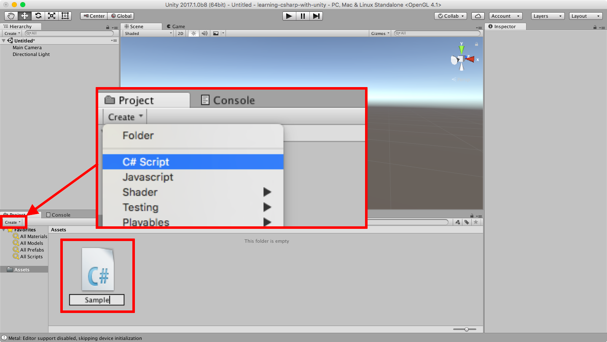
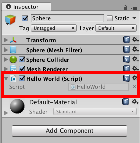

# Unityで覚える<span>C#</span>

---

# こんにちは

👇

+++


ないち

@naichilab

+++

## 何してる人？

* 職業：プログラマー
* 趣味：Unity/C#
* それっぽい資格
  * NW/DB/SCとか

---

# 今日話すこと

👇

+++

## <span>C#の"超"基礎</span>

を Unity 上で。

+++

## <span>C#</span>って？

プログラミング言語

+++

## Unityって？

ゲームエンジン

+++

## <span>C#</span>とUnityは別物！

それぞれにお作法がある。

覚えること多くて大変ですね。。。

---

# 対象

👇

+++

## 超初心者

Unity興味ある

&

プログラミング分かんない

みたいな人

---

# まずは全体像から

---

# <span>Unityのこと</span>

👇

+++

## Unityでは

* 世界(Scene)
* モノ(GameObject)
* 振る舞い(Component)

これらを組み合わせてゲームを作る。

+++


* 光やカメラを置いて
* 地面や建物、戦車を置いて
* "弾を打つ"などの振る舞いを与える

---

# 振る舞い

👇

+++

## 振る舞い

* 画像を表示する
* 文字を表示する
* 物理演算をする
* キー入力を受けて動かす

とか。

+++

プログラミングしなくても

結構な種類用意されてる。

+++

## でも

細かいところは自分で作らなきゃいけない。

* ゲームのルールとか
* 特殊な動き・演出とか

-> プログラミング<span>(C#)</span>の出番

+++

簡単に書けるなら苦労しないよ！

ってことで

ここから<span>C#</span>(プログラミング)の話。

---

# <span>C#</span>

👇

+++

### どこから話そうか・・・

変数/型/キャスト/コメント/関数/四則演算/配列/条件分岐/繰り返し/例外処理/クラスとインスタンス/構造体/定数/静的クラス/列挙型/プロパティ/デリゲート/ラムダ式/LINQ/…

+++

## キリがないので

簡単なものから

のんびり行きましょう

---

ここから先、

説明＆デモの繰り返しです。

---

なるべくサンプル用意してます。

興味が湧いたら

あとでダウンロードしてください。

👇

+++

## ダウンロード

[naichilab/learning-csharp-with-unity](https://github.com/naichilab/learning-csharp-with-unity)

---

## 今日の目標

* Unityの準備
* <span>C#</span>スクリプトの作成方法
* Hello World!!
* 型と変数
* 四則演算
* 関数
* インスタンス
* クラス変数

---

## Unityの準備

👇

+++


レイアウトを初期化しておく

+++

慣れたら好きなレイアウトでどうぞ。

---

## <span>C#</span>スクリプトの作成方法

sample : create-script

👇

+++



Project -> Create -> C# Script

+++


できたファイルをダブルクリックで開く

+++


MonoDevelopというエディタが開く

+++?code=Assets/create-script/Sample.cs

簡単に説明

@[1-101](こんな感じのファイルが開きます)
@[1-3](他のファイルを読み込んで使うよーって宣言)
@[1-3](まだ気にしなくていいです)
@[5](Sample : クラス=振る舞い の名前)
@[5](Unity上で作ると必ずMonoBehaviourと書かれる)
@[8-12](Start : 実行時、はじめに1回だけ呼ばれる)
@[14-18](Update : 実行時、毎フレーム呼ばれる)

+++

これで雛形は完成

ここに処理を書き込んでいきます。

+++

(ハマりポイント)


これはUnityの決まりごと。

---

## Hello World!!

お決まりの練習。

sample : helloworld

👇

+++


`HelloWorld` スクリプトを作成

(さっきと別ファイル)

+++?code=Assets/helloworld/HelloWorld.cs

Startの中に１行追加する

@[10] (こんな感じ)

+++

## プログラム完成！

`振る舞い` の定義はできた。

+++

## でも

これだけでは動かない。

`振る舞い` は `モノ` に付ける必要がある。

+++

モノ(GameObject)の作成

+++


Hierarchy -> Create -> Create Empty

+++


`GameObject` という名前のモノが作られた。

+++


分かりにくいのでリネームしましょう。

-> `HelloWorld`

+++


モノを選択すると、振る舞い一覧が表示される

+++


Hierarchy -> Add Component -> Hello World

+++



(振る舞いが)ついた！

+++


やっと実行（再生ボタン）

+++


ボタンが青くなれば実行できている

+++


動いた！！（超地味）

+++


クリックするとちょっと詳しく見れる

+++

まとめ

1. C#スクリプト(振る舞い)を作る
1. モノを作る
1. モノに振る舞いを付ける
1. 動かす！

+++


---

## Debug.Log

👇

+++?code=Assets/helloworld/HelloWorld.cs

HelloWorldで使ったやつ

+++

`Debug.Log("XXXXX");`

これを書くと実行時にログが表示される。

+++

プログラムが思い通りに動いているか

確認する基本的な方法。

とりあえず困ったらコレ！

---

## コメント

sample : comment

👇

+++?code=Assets/comment/CommentSample.cs

スラッシュ２つ並べるとコメントが書ける

@[9-10](ここは処理されないコメント行)

+++

コメントは自由に書けます。

複雑になりそうならコメントを残しましょう。

---

## 変数

sample : variables

👇

+++?code=Assets/variables/Variables.cs

いきなりサンプル

@[9](textという箱<変数>を用意)
@[10](箱<変数>に文字列を入れる)
@[11](箱<変数>の内容をLogに書き出す)

+++

## 実行結果


---

## 変数の型（箱の形）

sample : built-in-types

👇

+++

箱<変数>には型がある。

* 文字列用の箱には文字列しか入らない
* 整数用の箱には整数しか入らない
* 少数用の箱には整数か少数しか入らない

+++

## <span>C#</span>に最初から用意されている型

| 型名 | 入れられる値 |
| --- | ---- |
| string | 文字列 |
| int | 整数 |
| float | 少数 |

他にもいっぱい -> [組み込み型一覧](https://docs.microsoft.com/ja-jp/dotnet/csharp/language-reference/keywords/built-in-types-table)

+++

```
//文字列の変数
string txt = "こんにちは";

//整数の変数
int num1 = 12;

//小数の変数
float num2 = 1.23f;
```

+++

## 型に合わない値は入れられない。

```
//これらはエラーする
string txt2 = 123;
int num4 = "aaa";
```

+++

※エラーの例

```
error CS0029: Cannot implicitly convert type `int' to `string'
```

intからstringに変換できません!!

エラーよく読めば単純な場合が多い。英語だけど頑張って！


---

## 組み込み型

C#は、整数や文字列など、よく使う

C#には、整数や文字列など、よく使うものにはプログラミングでよく使う `型` Unityには、


---
## 四則演算

👇

---
## 関数

👇

---
## インスタンス

👇

---
## クラス変数

👇

---


## <span>C#のこと</span>

---


* 型/演算子/変数/関数/クラス/インスタンス/関数/......

---

# Hello, World!!

---

こんにちは！!

---

```
using System.Collections;
using System.Collections.Generic;
using UnityEngine;

public class MyMonoBehaviour : MonoBehaviour {

	// Use this for initialization
	void Start () {

	}

	// Update is called once per frame
	void Update () {

	}

}
```
あ〜〜〜〜

@[1](ほげ aaa jjiugfy gugiuh)
@[3](dydfiguygiughoi)
@[5-7](aaaaaaaaa)

---?code=path/to/source.file


---

EOF
